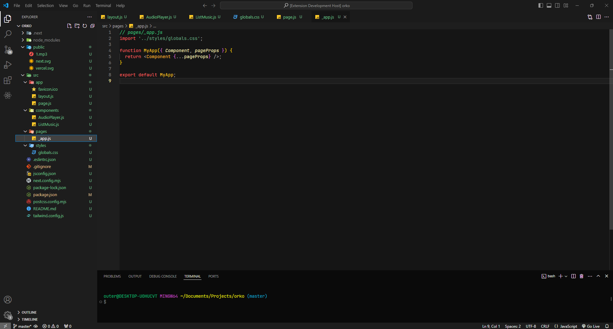

# UnyoDusk VSCode Theme

## Description

UnyoDusk is a dark, elegant VSCode theme inspired by the tranquility and subtle beauty of dusk. With a harmonious blend of warm and cool tones, this theme offers a perfect balance for both daytime and nighttime coding sessions. Highlighting with soft oranges and purples, UnyoDusk ensures a comfortable and immersive coding experience, reducing eye strain while maintaining visual appeal. Ideal for developers who seek both functionality and aesthetics, UnyoDusk transforms your workspace into a serene and productive environment.

## Features

- **Dark Mode:** A soothing dark background that reduces eye strain during extended coding sessions.
- **Elegant Highlighting:** Soft orange and purple tones for syntax highlighting to enhance readability.
- **Balanced Color Scheme:** A harmonious blend of warm and cool colors for a visually appealing workspace.
- **Enhanced Focus:** Carefully selected colors to minimize distractions and keep you focused on your code.

## Installation

1. Open Visual Studio Code.
2. Go to the Extensions view by clicking on the Extensions icon in the Activity Bar on the side of the window.
3. Search for "UnyoDusk" in the Extensions Marketplace.
4. Click "Install" to install the theme.
5. Once installed, go to the Command Palette (Ctrl+Shift+P or Cmd+Shift+P) and type `Preferences: Color Theme`.
6. Select "UnyoDusk" from the list of available themes.

## Screenshots

## Acknowledgements

Special thanks to the community for their feedback and support.

---

Enjoy coding with UnyoDusk! 🌆
